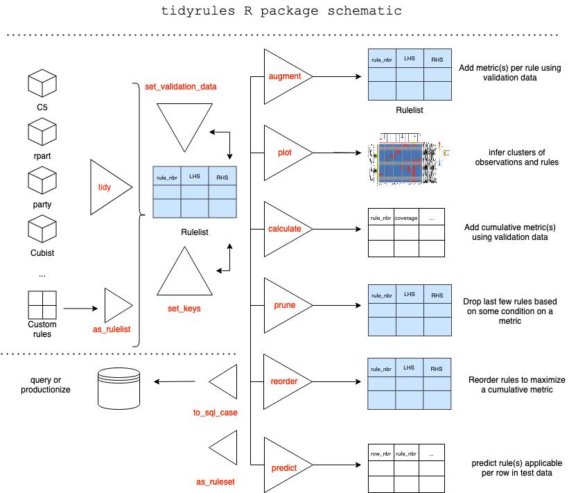

## Abstract

> [tidyrules](https://cran.r-project.org/package=tidyrules) [R](https://www.r-project.org/) [package](https://cran.r-project.org/) provides a framework to work with decision rules. Rules can be extracted from supported models, augmented with (custom) metrics using validation data, manipulated using standard dataframe operations, reordered and pruned based on a metric, predict on unseen (test) data. Utilities include; Creating a rulelist manually, Exporting a rulelist as a SQL case statement and so on. The package offers two classes; rulelist and rulelset based on dataframe.

website: https://talegari.github.io/tidyrules/

## Schematic


```{r, include = FALSE}
library("dplyr")
devtools::load_all()
```

## About

This document provides a working example of a classification problem where the functionality of package is showcased. We use `modeldata::attrition` dataset where `Attrition` column is the binary dependent variable.


```{r, eval = FALSE}
library("tidyrules")
```

```{r}
att = modeldata::attrition
set.seed(1)
valid_index = sample(c(TRUE, FALSE), nrow(att), replace = TRUE)
att_train = att[!valid_index, ] # nrow: 742
att_valid = att[valid_index, ]  # nrow: 728
glimpse(att)
```

## Tidy

`tidy` generic creates `rulelist` from a supported model fit. `rulelist` class is fundamental data structure which offers many methods such as `predict`, `augment` and so on. A `rulelist` is a dataframe with some extra attributes. The order of rows of the dataframe defines the order of preference of rules.

`tidy` supports these model fits:

- `C5` rule-based model (classification)
- `rpart` tree (classification / regression)
- `party` tree (classification / regression)
- `cubist` tree (regression)

Lets build a C5 model and then extract a rulelist:

```{r}
model_c5 = C50::C5.0(Attrition ~., data = att_train, rules = TRUE)
model_c5
```

```{r, collapse = TRUE}
tidy_c5 = tidy(model_c5)
tidy_c5
```

## Rulelist

A rulelist is expected to have these mandatory columns: 

- `rule_nbr`: Something that identifies a rule uniquely per `keys`. Typically, an integer vector starting from 1.
- `LHS`: A character vector of R-parsable strings
- `RHS`: factor (for classification), numeric (for regression) or character vector of R-parsable strings (to be evaluated)

`trial_nbr` is a key. `C5` model builds multiple boosting iterations indexed by `trial_nbr` (default is set to 1). `rule_nbr`'s start from 1 for each `trial_nbr`. In general, `keys` columns along with `rule_nbr` column should be unique.

Attribute `estimation_type` is central to further methods where metrics get computed. At this moment, the package supports these: `classification`, `regression`.

The rulelist (obtained from `C5` model) ordered by `confidence` column, by default.

A rulelist can be either created using `tidy` on a supported model or a from a dataframe using `as_rulelist`.

> `r paste0(rep(cli::symbol$smiley, 3), collapse = "")` rulelist is simply a dataframe with some attributes. Manipulate them with standard dataframe operations (`dplyr`, `data.table` ...). `tibble::as_tibble` or `as.data.frame` will convert to a tibble/dataframe (with attributes). `as_rulelist` can be used to convert to a rulelist.

## Predict

The mainstay of package is the `predict` method of the rulelist class. `predict` provides the first rule (in the order as per the rulelist) that is applicable for a observation/row in the test data. If a row is not *covered* by any rule, then `rule_nbr` is missing.

```{r, eval = FALSE}
predict(tidy_c5, att_valid)
```

```{r, echo = FALSE}
tibble::as_tibble(predict(tidy_c5, att_valid))
```

> `r paste0(rep(cli::symbol$smiley, 3), collapse = "")` To know all rules applicable for a row, use argument `multiple = TRUE`. Alternately, `predict` on a ruleset always yields all rules applicable per row.

```{r, eval = FALSE}
predict(tidy_c5, att_valid, multiple = TRUE)
```

```{r, echo = FALSE}
tibble::as_tibble(predict(tidy_c5, att_valid, multiple = TRUE))
```

## Setters

- `set_validation_data`: Setting (or removing) validation data adds a validation data to a rulelist which gets used for `augment`, `calculate` and other methods. 

- `set_keys`: Sets (or removes) keys.

```{r}
tidy_c5 =
  tidy_c5 %>%
  set_validation_data(att_valid, y_name = "Attrition", weight = 1) %>% 
  set_keys(NULL)

tidy_c5
```

> `r paste0(rep(cli::symbol$smiley, 3), collapse = "")` Setting weight argument (other than 1 which means equal weight) leads to calculating weighted metrics.

## Augment

`augment` adds metrics related to validation data in a new column 'augmented_stats'.

```{r}
tidy_c5 %>% 
  augment() %>% 
  tibble::as_tibble() %>% 
  tidytable::unnest(names_sep = "__") %>% 
  glimpse()
```

> `r paste0(rep(cli::symbol$smiley, 3), collapse = "")` If augmented metrics differ from train data metrics, then it could indicate drift in the data!

> `r paste0(rep(cli::symbol$smiley, 3), collapse = "")` `augment` also supports custom metrics in `dplyr::summarise` syntax!

## Plot

Plotting a rulelist as a heatmap helps in understanding these things:

- Cluster of rows which are *covered* by same set of rules (with hclust)
- Cluster rules based on the common rows they *cover (with hclust)
- Row and column labels with dependent variable help us identify potential outliers and potential under-fitting.

```{r, out.width = "100%"}
plot(tidy_c5)
```

> `r paste0(rep(cli::symbol$smiley, 3), collapse = "")` distance metric for rules is `jaccard` and distance metric for row clusters is `euclidean`. Former can be changed to any distance supported by `proxy` package or a custom distance function for custom insight!

> `r paste0(rep(cli::symbol$smiley, 3), collapse = "")` When you have a rulelist which is a combination of multiple classifiers, rule clusters quickly reveal 'correlated' rules! The ones which cover almost same rows, but LHS of each reads different!

## Calculate

`calculate` computes cumulative metrics (as rules are applied in the row order) depending on attribute `estimation_type`.

```{r, eval = FALSE}
calculate(tidy_c5)
```

```{r, echo = FALSE}
tibble::as_tibble(calculate(tidy_c5))
```

> `r paste0(rep(cli::symbol$smiley, 3), collapse = "")` `calculate` allows a custom metric of your choice!

## Reorder

`reorder` intends to reorder the order of rules. At the moment, the greedy implementation adds one rule at a time to a new rulelist (from the input rulelist) such that a metric (see `calculate`) is maximized/minimized.

Suppose, you wanted to find a smaller ruleset with least overlap that would still cover 80% of the validation_data. Then,

```{r, cache=TRUE}
reorder(tidy_c5,
        metric = c("cumulative_overlap",
                   "cumulative_coverage",
                   "cumulative_accuracy"
                   ),
        minimize = TRUE
        ) %>% 
  mutate(rel_cum_overlap = 
           cumulative_overlap / max(cumulative_overlap),
         rel_cum_coverage = 
           cumulative_coverage / max(cumulative_coverage)
         ) %>% 
  select(rule_nbr, LHS, RHS,
         rel_cum_overlap, rel_cum_coverage,
         cumulative_accuracy
         )
```

we infer that first 9 rules (~ 20% overlap) in the reordered rulelist would do still ensuring an accuracy of 85% !

> `r paste0(rep(cli::symbol$smiley, 3), collapse = "")` In the above code, 2nd metric onwards are used to break ties! (similar to `base::order`)

> `r paste0(rep(cli::symbol$smiley, 3), collapse = "")` Reordering changes the decision boundaries of your fit! It is a post-hoc method to overlap the *learnt* rules to optimize for the metric you need! But remember, greedy optimization method does guarantee the global minima (maxima)!

> `r paste0(rep(cli::symbol$smiley, 3), collapse = "")` `reorder` comes with a `init = k` argument which leaves a predecided top k rules in their order and reorders only bottom ones. This might be required when policy layer needs to be incorporated into the rule engine!

## Prune

`prune` suggests k th rule to stop at based on some stopping criteria.

Suppose, we seek to find a smaller rulelist with maximum possible accuracy with a minimum (relative) coverage of 70% and (relative) overlap not more than half the number of rows. Then,

```{r, cache = TRUE}
prune_suggestion = 
  reorder(tidy_c5, "cumulative_accuracy", minimize = FALSE) %>% 
  prune(stop_expr_string = "relative__cumulative_coverage >= 0.7 & cumulative_overlap <= 728/2")

prune_suggestion
plot(prune_suggestion)
prune_suggestion$pruned
```

> `r paste0(rep(cli::symbol$smiley, 3), collapse = "")` `prune` is powerful when combined with `reorder`! While `reorder` chases a metric, `prune` takes care of constraints! This might lead to small rulelists, very good for explainability!

## Out in the Wild

Use `to_sql_case` to get SQL case when code chunk from a rulelist.

```{r, eval = FALSE}
to_sql_case(head(tidy_c5, 5))
```

```
CASE
WHEN (Age > 26)
    AND (EnvironmentSatisfaction IN ( 'Medium', 'High', 'Very_High' ))
    AND (PercentSalaryHike <= 17)
    AND (StockOptionLevel > 0)
    AND (StockOptionLevel <= 2)
    AND (TotalWorkingYears > 2) THEN
   'No'
WHEN (Age > 26)
    AND (EnvironmentSatisfaction IN ( 'Medium', 'High', 'Very_High' ))
    AND (StockOptionLevel > 0)
    AND (YearsAtCompany > 3) THEN
   'No'
WHEN (BusinessTravel = 'Non-Travel') THEN
   'No'
WHEN (Age <= 31)
    AND (EducationField = 'Technical_Degree')
    AND (StockOptionLevel <= 0) THEN
   'Yes'
WHEN (JobSatisfaction IN ( 'Low', 'Medium', 'High' ))
    AND (MonthlyIncome > 3210)
    AND (RelationshipSatisfaction IN ( 'Medium', 'High', 'Very_High' ))
    AND (TrainingTimesLastYear > 2) THEN
   'No'
ELSE
   NULL
END AS output
```

## More

- We will add `tidy` support to more models. Your contributions are welcome!
- Ideas for new methods are welcome!

`r cli::symbol$tick` `For dev and issues, reach us at http://github.com/talegari/tidyrules

`r cli::symbol$tick` 'master' branch always holds the 'tested' dev code!

`r cli::symbol$tick` Get the latest stable version from CRAN!

Yours truly,  
Amith (ಅಮಿತ್) and Srikanth (ಶ್ರೀಕಾಂತ)


